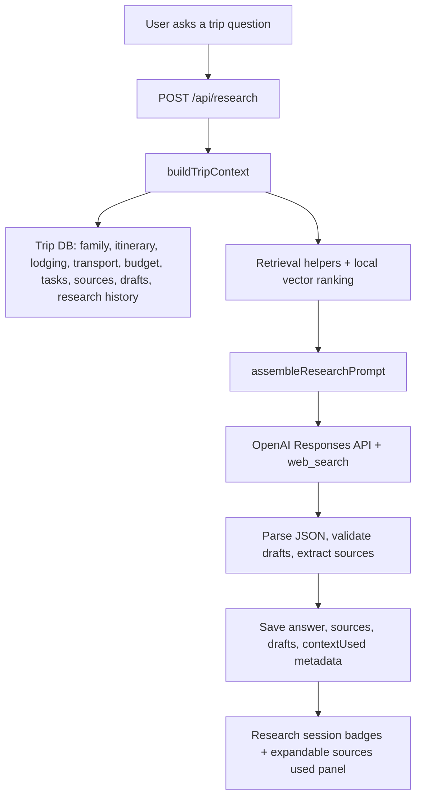

# Context-Aware AI Architecture

## Refactored Runtime

The research agent now follows this flow:



## Folder Structure

```txt
server/
  ai/
    buildTripContext.ts      # Central context aggregation layer
    promptAssembler.ts       # Prompt assembly and response rules
    retrieval.ts             # Domain retrieval helpers
    types.ts                 # AITripContext and related interfaces
    vectorSearch.ts          # Embedding-ready semantic ranking
  research.ts                # LLM orchestration

src/
  App.tsx                    # Context badges, loading state, sources panel
  types.ts                   # ResearchAnswer.contextUsed metadata

tests/
  aiContext.test.ts          # Context builder + prompt regression tests
  api.test.ts                # /api/research prompt injection regression
```

## Retrieval Layers

Implemented helpers:

- `getFamilyProfiles()`
- `getTripLodging()`
- `getCurrentItinerary()`
- `getDestinationNotes()`
- `getTransportationContext()`
- `searchTripResearch()`
- `getUploadedDocuments()`
- `getTripMemory()`

The context builder infers intent from the user question, ranks trip documents, compresses itinerary days, and passes only relevant context into the model prompt.

## Vector Search

`server/ai/vectorSearch.ts` provides an embedding-ready retrieval layer:

- Local deterministic embeddings for tests and offline development.
- Intent-aware lexical/semantic ranking across saved research, source notes, itinerary notes, destination guides, lodging notes, uploaded document metadata, and task notes.
- `createOpenAIEmbedding()` as the integration point for OpenAI embeddings.

Production upgrade path:

1. Store `TripResearchDocument` chunks in Postgres with `pgvector`.
2. Populate embeddings with `text-embedding-3-small`.
3. Replace the in-memory ranking call in `searchTripResearch()` with a vector SQL query filtered by `tripId`, `document.type`, and inferred intent.

## Optimized Prompt Pattern

The prompt now injects:

- Active trip ID and trip summary.
- Current family and child ages.
- Known lodging by base and date.
- Relevant itinerary window.
- Transportation segments.
- Destination metadata.
- Budget summary.
- Preferences and trip priorities.
- Retrieved saved research and uploaded document metadata.
- Memory from prior recommendations, applied drafts, and dismissed drafts.
- Missing-data rules.

Key guardrail:

```txt
Never say you do not have access to family profiles, traveler ages, itinerary stops,
lodging selections, transportation plans, budgets, saved research, or preferences
when those details are present below.
```

## API Route

Current Express route:

```ts
app.post('/api/research', async (request, response, next) => {
  try {
    const input = researchSchema.parse(request.body);
    response.json(await answerResearchQuestion({ ...input, apiKey: openAiApiKey, db }));
  } catch (error) {
    next(error);
  }
});
```

Next.js App Router equivalent:

```ts
export async function POST(request: Request) {
  const input = researchSchema.parse(await request.json());
  const db = createTripDatabase();
  return Response.json(await answerResearchQuestion({
    ...input,
    apiKey: process.env.OPENAI_API_KEY,
    db
  }));
}
```

Server action equivalent:

```ts
'use server';

export async function askTripResearch(question: string, deep = false, context?: string) {
  const db = createTripDatabase();
  return answerResearchQuestion({
    question,
    deep,
    context,
    apiKey: process.env.OPENAI_API_KEY,
    db
  });
}
```
